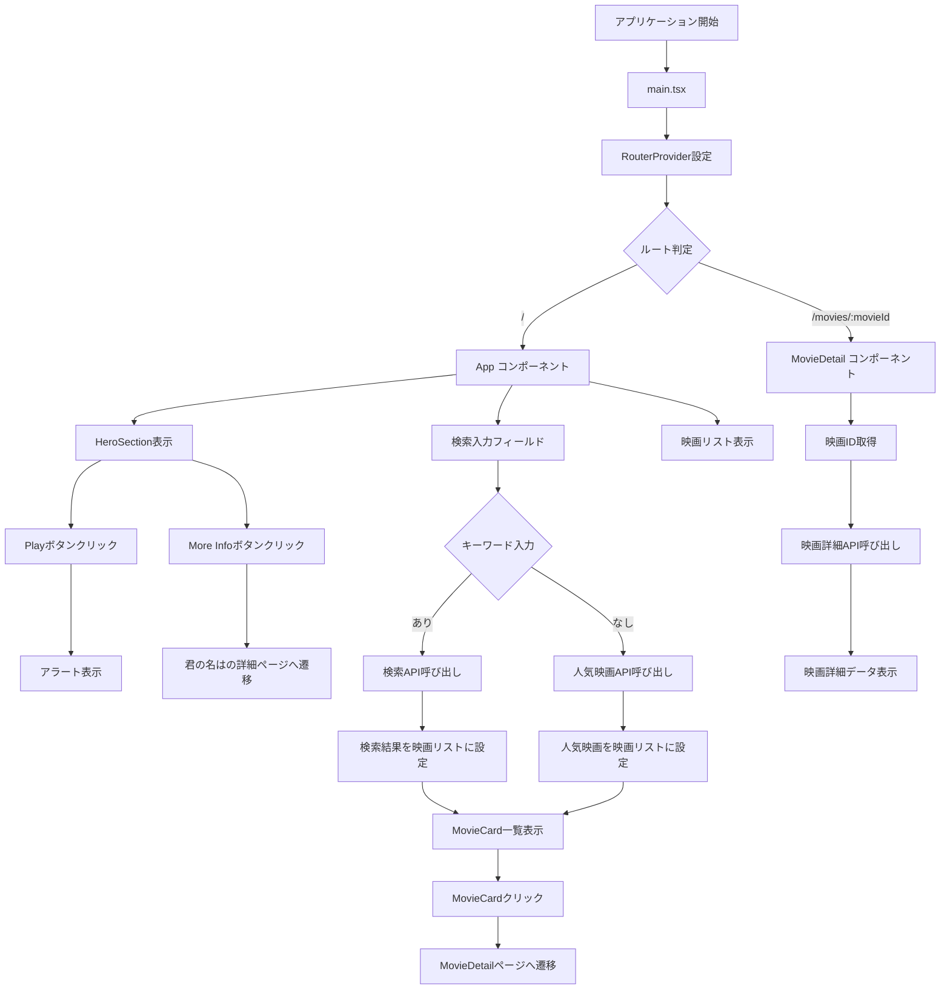

# アプリケーション全体フローチャート

この図は、Movie Applicationの全体的な処理フローを示しています。

## 説明

1. **アプリケーション開始**: main.tsxからアプリケーションが起動
2. **ルーティング**: React Routerによるページ分岐
3. **ホーム画面**: HeroSection、検索機能、映画リスト表示
4. **検索機能**: キーワードに基づく動的な映画検索
5. **映画詳細**: 個別の映画情報表示
6. **ユーザー操作**: ボタンクリックやリンク遷移による画面遷移
