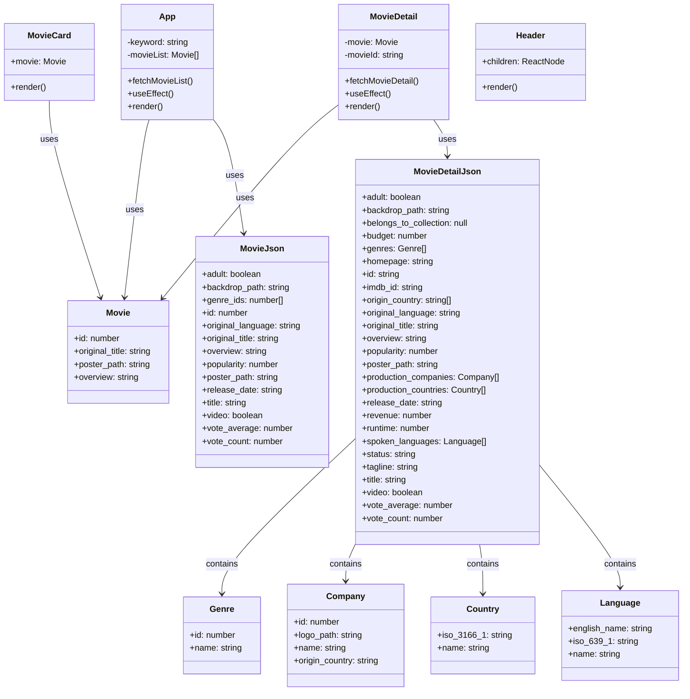

# クラス図

この図は、Movie Applicationのコンポーネントと型定義の関係を示しています。

## 説明

### コンポーネントクラス

- **App**: メインアプリケーションコンポーネント、映画リストの管理とAPI呼び出しを担当
- **MovieCard**: 個別の映画カード表示コンポーネント
- **MovieDetail**: 映画詳細ページコンポーネント、詳細情報の取得と表示を担当
- **Header**: アプリケーションのヘッダーコンポーネント

### 型定義クラス

- **Movie**: アプリケーション内で使用する映画データの基本型
- **MovieJson**: TMDB APIから取得する映画データの型
- **MovieDetailJson**: TMDB APIから取得する映画詳細データの型

### 関連型クラス

- **Genre**: ジャンル情報
- **Company**: 制作会社情報
- **Country**: 制作国情報
- **Language**: 言語情報

これらの型定義により、TypeScriptの型安全性が保たれ、開発時のエラーを防ぐことができます。
