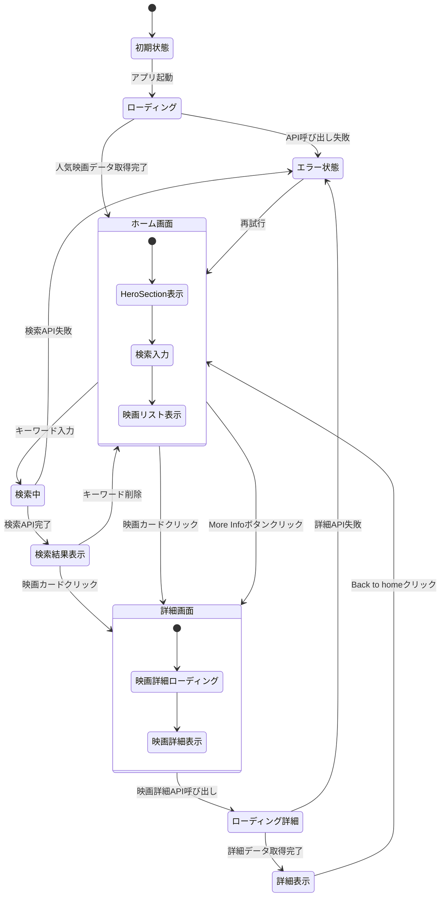

# 状態遷移図

この図は、Movie Applicationの状態変化とユーザー操作による画面遷移を示しています。

## 状態説明

### メイン状態

- **初期状態**: アプリケーション起動時の状態
- **ローディング**: API呼び出し中の状態
- **ホーム画面**: メイン画面（HeroSection、検索、映画リスト）
- **検索中**: 検索API呼び出し中の状態
- **検索結果表示**: 検索結果を表示している状態
- **詳細画面**: 映画詳細ページ
- **ローディング詳細**: 映画詳細API呼び出し中の状態
- **詳細表示**: 映画詳細を表示している状態
- **エラー状態**: API呼び出し失敗時の状態

### サブ状態

#### ホーム画面の内部状態
- **HeroSection表示**: ヒーローセクションの表示
- **検索入力**: 検索フィールドでの入力待ち
- **映画リスト表示**: 映画カード一覧の表示

#### 詳細画面の内部状態
- **映画詳細ローディング**: 詳細データの取得中
- **映画詳細表示**: 詳細情報の表示完了

## 遷移条件

1. **アプリ起動**: 初期状態からローディングへ
2. **データ取得完了**: ローディングからホーム画面へ
3. **キーワード入力**: ホーム画面から検索中へ
4. **検索完了**: 検索中から検索結果表示へ
5. **映画カードクリック**: 任意の画面から詳細画面へ
6. **Back to home**: 詳細表示からホーム画面へ
7. **エラー発生**: 任意のAPI呼び出しからエラー状態へ
8. **再試行**: エラー状態からホーム画面へ
