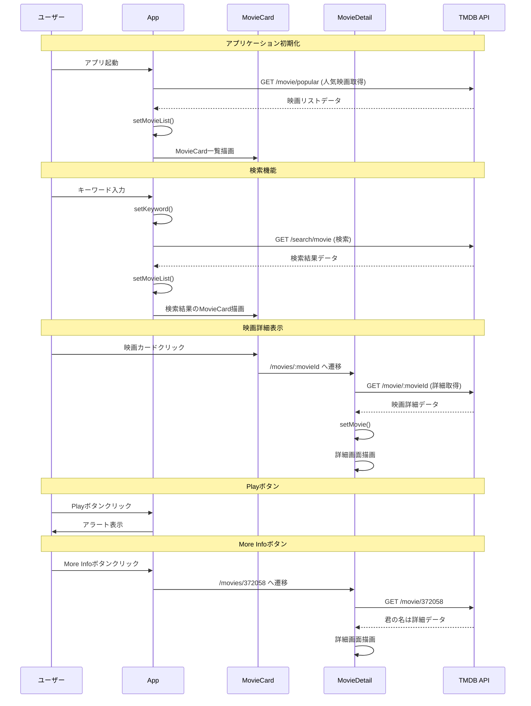

# シーケンス図

この図は、ユーザー操作とAPI呼び出しの時系列的な流れを示しています。

## シーケンス説明

### 1. アプリケーション初期化

1. ユーザーがアプリケーションを起動
2. AppコンポーネントがTMDB APIに人気映画データを要求
3. APIから映画リストデータを受信
4. 状態を更新し、MovieCardコンポーネントで映画一覧を描画

### 2. 検索機能

1. ユーザーが検索キーワードを入力
2. Appコンポーネントの状態が更新される
3. TMDB APIに検索リクエストを送信
4. 検索結果を受信し、状態を更新
5. 新しい検索結果でMovieCard一覧を再描画

### 3. 映画詳細表示

1. ユーザーが映画カードをクリック
2. React RouterでMovieDetailページに遷移
3. MovieDetailコンポーネントが映画IDを取得
4. TMDB APIに映画詳細データを要求
5. 詳細データを受信し、詳細画面を描画

### 4. Playボタン

1. ユーザーがPlayボタンをクリック
2. Appコンポーネントがアラートを表示（未実装機能の通知）

### 5. More Infoボタン

1. ユーザーがMore Infoボタンをクリック
2. React Routerで君の名はの詳細ページ（ID: 372058）に遷移
3. MovieDetailコンポーネントが君の名はの詳細データを取得
4. 詳細画面を描画

## 参加者の役割

- **ユーザー**: アプリケーションを操作するエンドユーザー
- **App**: メインアプリケーションコンポーネント、映画リストの管理
- **MovieCard**: 個別映画カードの表示とクリックイベントの処理
- **MovieDetail**: 映画詳細ページの表示とデータ管理
- **TMDB API**: 映画データを提供する外部APIサービス
