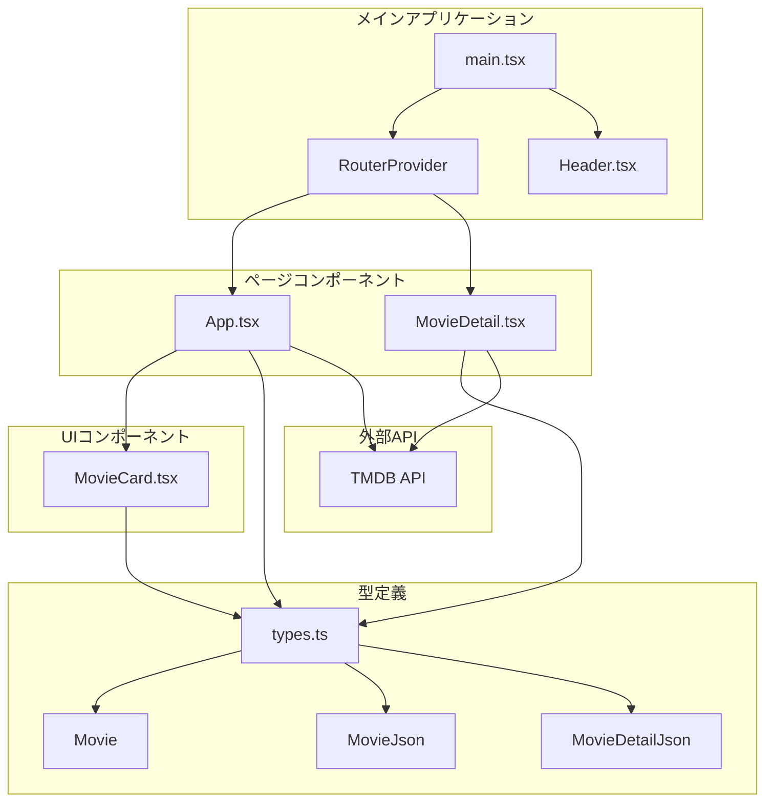

# コンポーネント関係図

この図は、Movie Applicationのコンポーネント間の依存関係と構造を示しています。

## 関係説明

### メインアプリケーション層

- **main.tsx**: アプリケーションのエントリーポイント
  - RouterProviderを設定してルーティングを管理
  - Headerコンポーネントで全体のレイアウトを提供

### ページコンポーネント層

- **App.tsx**: ホームページコンポーネント
  - 映画リストの管理と表示
  - 検索機能の実装
  - HeroSectionの表示
  - MovieCardコンポーネントの使用
  - TMDB APIとの通信

- **MovieDetail.tsx**: 映画詳細ページコンポーネント
  - 個別映画の詳細情報表示
  - TMDB APIとの通信
  - 型定義の使用

### UIコンポーネント層

- **MovieCard.tsx**: 再利用可能な映画カードコンポーネント
  - 映画の基本情報表示
  - クリック時の詳細ページへの遷移

### 型定義層

- **types.ts**: 共通の型定義ファイル
  - Movie: アプリケーション内で使用する映画データ型
  - MovieJson: TMDB APIから取得する映画データ型
  - MovieDetailJson: TMDB APIから取得する映画詳細データ型

### 外部API層

- **TMDB API**: The Movie Database API
  - 映画データの提供
  - 検索機能の提供
  - 映画詳細情報の提供

## 依存関係の特徴

1. **一方向の依存**: 上位コンポーネントから下位コンポーネントへの依存
2. **型安全性**: 全てのコンポーネントが共通の型定義を使用
3. **外部API統合**: AppとMovieDetailがTMDB APIと直接通信
4. **再利用性**: MovieCardは独立したコンポーネントとして設計
5. **ルーティング**: React Routerによるページ間の遷移管理

この構造により、保守性、拡張性、テスタビリティが確保されています。
